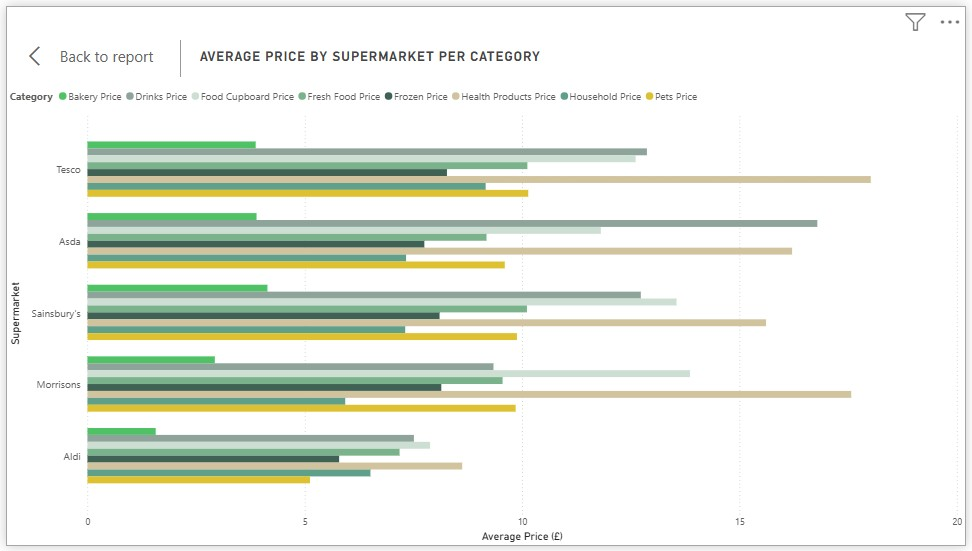

# Q1: Which Supermarket is the Cheapest per Category?

### Overview 

This clustered bar chart shows the average price of all categories in the top 5 supermarkets in the UK.



## SQL Code

```sql 
/* 
 Which supermarket is the cheapest per category?
 (bakery, drinks, food_cupboard, fresh_food, frozen, health_products, household, pets)
 -To remove anomalies filter by prices unit < 100
 */

--Aldi
SELECT
--Average category
    'Aldi' AS supermarket,
    ROUND(AVG(CASE WHEN category = 'bakery' THEN prices_unit END), 2) AS avg_bakery_price,
    ROUND(AVG(CASE WHEN category = 'drinks' THEN prices_unit END), 2) AS avg_drinks_price,
    ROUND(AVG(CASE WHEN category = 'food_cupboard' THEN prices_unit END), 2) AS avg_food_cupboard_price,
    ROUND(AVG(CASE WHEN category = 'fresh_food' THEN prices_unit END), 2) AS avg_fresh_food_price,
    ROUND(AVG(CASE WHEN category = 'frozen' THEN prices_unit END), 2) AS avg_frozen_price,
    ROUND(AVG(CASE WHEN category = 'health_products' THEN prices_unit END), 2) AS avg_health_products_price,
    ROUND(AVG(CASE WHEN category = 'household' THEN prices_unit END), 2) AS avg_household_price,
    ROUND(AVG(CASE WHEN category = 'pets' THEN prices_unit END), 2) AS avg_pets_price,

--overall average price
    ROUND((
        AVG(CASE WHEN category = 'bakery' THEN prices_unit END) +
        AVG(CASE WHEN category = 'drinks' THEN prices_unit END) +
        AVG(CASE WHEN category = 'food_cupboard' THEN prices_unit END) +
        AVG(CASE WHEN category = 'fresh_food' THEN prices_unit END) +
        AVG(CASE WHEN category = 'frozen' THEN prices_unit END) +
        AVG(CASE WHEN category = 'health_products' THEN prices_unit END) +
        AVG(CASE WHEN category = 'household' THEN prices_unit END) +
        AVG(CASE WHEN category = 'pets' THEN prices_unit END)
    ) / 8, 2) AS overall_avg_price

FROM aldi

UNION ALL

--Tesco
SELECT
--average category
    'Tesco' AS supermarket,
    ROUND(AVG(CASE WHEN category = 'bakery' THEN prices_unit END), 2),
    ROUND(AVG(CASE WHEN category = 'drinks' THEN prices_unit END), 2),
    ROUND(AVG(CASE WHEN category = 'food_cupboard' THEN prices_unit END), 2),
    ROUND(AVG(CASE WHEN category = 'fresh_food' THEN prices_unit END), 2),
    ROUND(AVG(CASE WHEN category = 'frozen' THEN prices_unit END), 2),
    ROUND(AVG(CASE WHEN category = 'health_products' THEN prices_unit END), 2),
    ROUND(AVG(CASE WHEN category = 'household' THEN prices_unit END), 2),
    ROUND(AVG(CASE WHEN category = 'pets' THEN prices_unit END), 2),

--overall average price  
    ROUND((
        AVG(CASE WHEN category = 'bakery' THEN prices_unit END) +
        AVG(CASE WHEN category = 'drinks' THEN prices_unit END) +
        AVG(CASE WHEN category = 'food_cupboard' THEN prices_unit END) +
        AVG(CASE WHEN category = 'fresh_food' THEN prices_unit END) +
        AVG(CASE WHEN category = 'frozen' THEN prices_unit END) +
        AVG(CASE WHEN category = 'health_products' THEN prices_unit END) +
        AVG(CASE WHEN category = 'household' THEN prices_unit END) +
        AVG(CASE WHEN category = 'pets' THEN prices_unit END)
    ) / 8, 2) AS overall_avg_price

FROM tesco

ORDER BY overall_avg_price ASC;
```